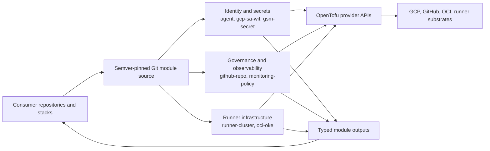

# Terraform Modules System Context

This repository publishes reusable OpenTofu modules as semver-pinned Git
sources. Consumer repositories choose a module, provide environment-specific
inputs, and own planning and applying it; this repository does not apply
infrastructure itself.

## Boundaries

- Module source, variables, outputs, provider constraints, tests, and generated
  module documentation live in this repository.
- Consumers pin immutable release tags and own backend state, provider
  credentials, plans, applies, and rollbacks.
- Cloud and platform APIs create the real resources; this repository contains no
  live state or credentials.
- CI formats, lints, validates, security-scans, tests, and checks generated
  documentation without applying infrastructure.
