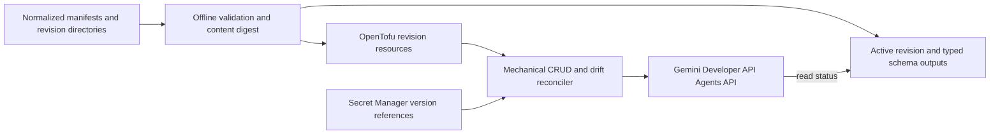

# gemini-managed-agents

Declares immutable Gemini Developer API managed agents from portable,
version-controlled directories.

## What and why

The Gemini Developer API exposes managed-agent CRUD but currently has no native
OpenTofu resource and no service-side versioning or rollback. This module turns
one or more normalized manifests into content-addressed agent revisions, keeps a
declared active revision for consumers, reports remote drift, and confines the
compatibility reconciler to mechanical API lifecycle work.

Agent behavior stays in reviewable directories: `.agents/AGENTS.md`, skills,
workspace sources, JSON Schema, evaluation cases, explicit tools, and a default
deny network policy. The module does not run an agent loop or invoke agents.

## Quickstart

Prerequisites: a Google Cloud project with the Generative Language API enabled
and OAuth application-default credentials with `cloud-platform` and
`generative-language.retriever` scopes. Managed agents are available subject to
the current free-tier quota as well as paid-tier terms.

```hcl
module "managed_agents" {
  source = "git::https://github.com/selamy-labs/terraform-modules.git//modules/gemini-managed-agents?ref=v0.9.0"

  project_id = "my-billed-project"
  manifest_paths = {
    document_reviewer = "${path.module}/agents/document-reviewer/agent.json"
  }
}

output "document_reviewer" {
  value = module.managed_agents.active_agents.document_reviewer
}
```

Start with the [minimal agent directory](examples/minimal/agents/document-reviewer),
then run:

```shell
tofu init
tofu apply
```

Expected result:

```text
Apply complete! Resources: 1 added, 0 changed, 0 destroyed.

document_reviewer = {
  agent_id = "document-reviewer-<16 hex characters>"
  model    = "gemini-3.7-flash"
  revision = "v1"
  ...
}
```

## Requirements

- OpenTofu `>= 1.8.0, < 2.0.0`.
- Python 3.11 or newer on the machine that runs OpenTofu.
- `hashicorp/external` exactly `2.4.1` (declared by the module).
- A project with `generativelanguage.googleapis.com` enabled. Free-tier use is
  subject to Google's current rate limit and quota.
- For paid-tier deployments, a billing-enabled project with an eligible Gemini
  API paid plan and—when assigned to Prepay—a positive prepaid-credit balance.
  Verify the current plan/status in Google AI Studio and prove an authenticated
  Agents API read before apply; a project billing link alone is insufficient.
- OAuth ADC by default. The optional API-key mode accepts only an immutable
  Secret Manager version reference; it never accepts key material.
- Secret Manager access for any MCP, network-header, or API-key references in a
  manifest.

The Gemini Developer API managed-agent surface is Public Preview. Review the
current service limits and terms before each sensitive or production adoption.

## Usage

### Directory contract

Each manifest owns one logical agent and one or more revision directories:

```text
agent.json
revisions/
└── v1/
    ├── instructions/system.md
    ├── runtime/
    │   ├── .agents/AGENTS.md
    │   ├── .agents/skills/<skill>/SKILL.md
    │   └── workspace/<version-controlled sources>
    ├── schemas/output.schema.json
    └── evaluations/cases.jsonl
```

`instructions/system.md` is the version-controlled top-level system instruction;
the manifest names its revision-relative path with `system_instruction`. Files
below `runtime/` become inline environment sources. The reconciler rejects
files over 1 MB or revisions over 2 MB, matching the service limits. Output
schemas and evaluation cases contribute to the revision digest and are returned
to consumers, but are not mounted into the runtime sandbox.

See the [complete example](examples/complete/) for the normalized manifest,
remote MCP tool subsets, immutable Secret Manager header references, typed
output, and evaluation cases.

### Immutable revisions and rollback

Every revision receives an ID formed from the logical name and its full manifest
digest. Keep old revisions declared while they may be rollback targets. Rollback
is only a manifest change:

```json
{
  "spec": {
    "active_revision": "v1"
  }
}
```

Changing `active_revision` changes the module output consumed by an invocation
boundary; it does not mutate either remote revision.

### Drift and repair

`drift_report` returns `current`, `missing`, or `drifted` for every revision.
Because OpenTofu command-backed resources have no native refresh callback, drift
repair is deliberately explicit and declarative. Increment the affected
revision's `lifecycle.reconcile_generation`, review the plan, and apply. The
reconciler then replaces the same content-addressed remote ID and verifies it.

### Ordered retirement

Destroy-time cleanup is attached to each declared revision resource. Set
`manifest_paths = {}` and apply before removing the module block itself;
OpenTofu cannot preserve a destroy-time provisioner after its entire
configuration block disappears. Confirm that `drift_report` no longer lists the
retired revisions, then remove the module block. The destroy action carries the
checked-in reconciler source in resource state, so cleanup does not depend on
the original checkout path. A direct `tofu destroy` also runs the declared
cleanup path.

Remote reads intentionally fail the plan if the API cannot be reached or
authenticated. Set `enable_remote_read = false` only for offline validation or
a controlled recovery, never as a steady-state drift bypass. Disabling reads
does not disable create, replace, or delete calls during apply and destroy.

### Secret handling

Header values are modeled as references such as:

```json
{
  "Authorization": {
    "secret_manager_version": "projects/my-project/secrets/catalog-token/versions/3",
    "prefix": "Bearer "
  }
}
```

Only the reference enters OpenTofu state. The reconciler retrieves the value at
runtime and sends it directly to the service. Numeric Secret Manager versions
are required so credential rotation is a reviewed replacement. When API-key
authentication is unavoidable, use a Google authorization key bound to a
service account and to the same Google Cloud project as `project_id`; do not use
a legacy unbound Standard key. Google documents that Standard keys will stop
working with the Gemini API in September 2026. OAuth remains the default.

## Architecture



The reconciler exists only because the current Google providers have no
Developer API agent resource. It implements read, create, replace, delete, and
drift comparison. It does not invoke interactions, execute tools, retry domain
work, or own workflow state. Delete it when native provider coverage reaches the
same contract.

## Configuration

The source of truth is the strict parser in
[`reconciler/agentctl.py`](reconciler/agentctl.py) and the checked-in examples.
Unknown manifest fields fail closed. The current portable seam accepts only the
`gemini_developer_api` backend; it reserves a backend discriminator without
shipping speculative alternate implementations.

Every revision must declare a version-controlled `system_instruction` path in
addition to its mounted `.agents/AGENTS.md`. Both contribute to the immutable
revision identity; the former is sent as the Agents API top-level instruction
and the latter remains part of the managed runtime directory contract.

Remote network access defaults to `disabled`. Allowlist mode rejects the `*`
catch-all, and every MCP hostname must be present in the allowlist. Tool arrays
are always sent explicitly so service defaults cannot silently grant Search,
URL Context, or Code Execution.

## Development

```shell
tofu fmt -check -recursive
tofu -chdir=modules/gemini-managed-agents init -backend=false
tofu -chdir=modules/gemini-managed-agents validate
tofu -chdir=modules/gemini-managed-agents test
python3 -m unittest discover \
  -s modules/gemini-managed-agents/reconciler/tests -v
```

The Python lifecycle suite launches a local fake Agents API and performs real
OpenTofu apply, idempotent plan, drift detection, declared reconciliation, and
destroy checks. Test-only API endpoint overrides are rejected unless explicit
test mode is enabled.

## Contributing

Follow the repository [contribution policy](../../CONTRIBUTING.md). Changes must
keep formatting, lint, security scan, validation, generated documentation,
unit/contract tests, idempotent apply, drift repair, and destroy tests green.

<!-- BEGIN_TF_DOCS -->
## Requirements

| Name | Version |
|------|---------|
| <a name="requirement_terraform"></a> [terraform](#requirement\_terraform) | >= 1.8.0, < 2.0.0 |
| <a name="requirement_external"></a> [external](#requirement\_external) | = 2.4.1 |

## Providers

| Name | Version |
|------|---------|
| <a name="provider_external"></a> [external](#provider\_external) | 2.4.1 |
| <a name="provider_terraform"></a> [terraform](#provider\_terraform) | n/a |

## Modules

No modules.

## Resources

| Name | Type |
|------|------|
| [terraform_data.revision](https://registry.terraform.io/providers/hashicorp/terraform/latest/docs/resources/data) | resource |
| [external_external.manifest](https://registry.terraform.io/providers/hashicorp/external/2.4.1/docs/data-sources/external) | data source |
| [external_external.revision_status](https://registry.terraform.io/providers/hashicorp/external/2.4.1/docs/data-sources/external) | data source |

## Inputs

| Name | Description | Type | Default | Required |
|------|-------------|------|---------|:--------:|
| <a name="input_manifest_paths"></a> [manifest\_paths](#input\_manifest\_paths) | Stable keys mapped to normalized managed-agent JSON manifests. Paths may be absolute or relative to the root module. | `map(string)` | n/a | yes |
| <a name="input_project_id"></a> [project\_id](#input\_project\_id) | Google Cloud project used by the Gemini Developer API. | `string` | n/a | yes |
| <a name="input_authentication"></a> [authentication](#input\_authentication) | API authentication. OAuth is preferred. API keys must be referenced by an immutable Secret Manager version and are read only by the reconciler at runtime. | <pre>object({<br/>    mode                           = optional(string, "oauth")<br/>    api_key_secret_manager_version = optional(string)<br/>  })</pre> | `{}` | no |
| <a name="input_enable_remote_read"></a> [enable\_remote\_read](#input\_enable\_remote\_read) | Read each remote revision during refresh and report missing or drifted agents. Disable only for offline validation and tests. | `bool` | `true` | no |
| <a name="input_python_executable"></a> [python\_executable](#input\_python\_executable) | Python 3.11+ executable used by the mechanical reconciler. | `string` | `"python3"` | no |

## Outputs

| Name | Description |
|------|-------------|
| <a name="output_active_agents"></a> [active\_agents](#output\_active\_agents) | Invocation contract for each manifest's declared active immutable revision. |
| <a name="output_drift_report"></a> [drift\_report](#output\_drift\_report) | Remote read result for each declared revision. Drift repair is an explicit reconcile\_generation manifest change. |
| <a name="output_revisions"></a> [revisions](#output\_revisions) | All declared immutable revisions keyed by content-addressed remote agent ID. |
<!-- END_TF_DOCS -->
